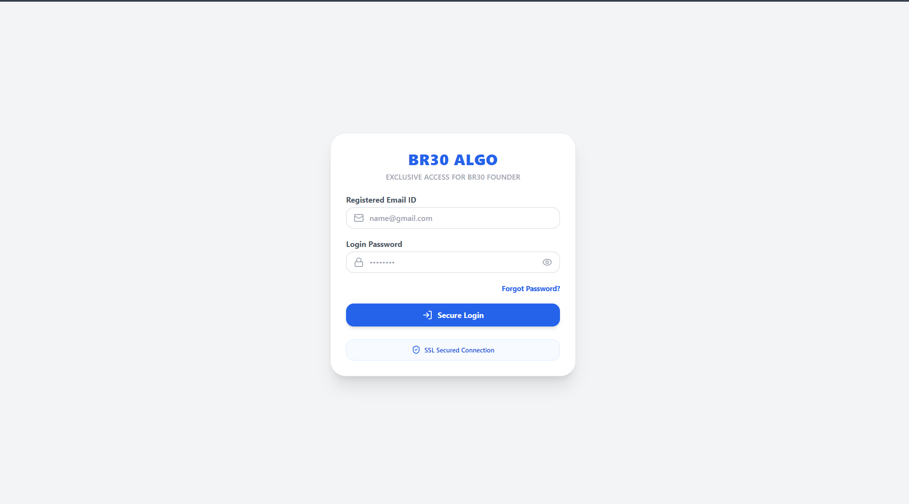

# BR30 Algo

🚀 BR30 Algo is a proprietary trading technology platform developed under the BR30 ecosystem.

The platform is focused on algorithmic trading tools, market analysis, automation systems and future trading innovations.

---

## 🌐 Live Platform

https://br30algo-com.vercel.app/

---

## 🌟 Features

- Trading Dashboard
- Market Analysis Tools
- Algorithmic Trading Framework
- User Authentication System
- Responsive Design
- Modern UI
- Trading Utilities
- Future Automation Ready
- Secure Architecture
- Performance Optimized

---

## 🛠️ Tech Stack

### Frontend

- React.js
- JavaScript
- Tailwind CSS
- Vite

### Deployment

- Vercel
- GitHub

---

## 📸 Screenshots

### 🏠 Dashboard Home

---

## 🚀 BR30 Ecosystem

- BR30 Group
- BR30 Trader
- BR30 Kart
- BR30 Algo
- BR30 Founder

---

## 👨‍💻 Developed By

Mukesh Raj

Founder — BR30 Group

---

## 📬 Connect With Me

- LinkedIn: https://www.linkedin.com/in/mukeshraj-br30/
- GitHub: https://github.com/mukeshkumarsingh7488-afk
- Instagram: https://www.instagram.com/br30Traderofficial
- YouTube: https://www.youtube.com/@br30traderofficial
- Telegram: https://t.me/+hBAT4kWo63A4ZWY1

---

## 🚀 Project Status

BR30 Algo is currently under active development and will continue to receive new trading tools, automation features and advanced market analysis capabilities.

---

### Build • Automate • Analyze • Grow 🚀
